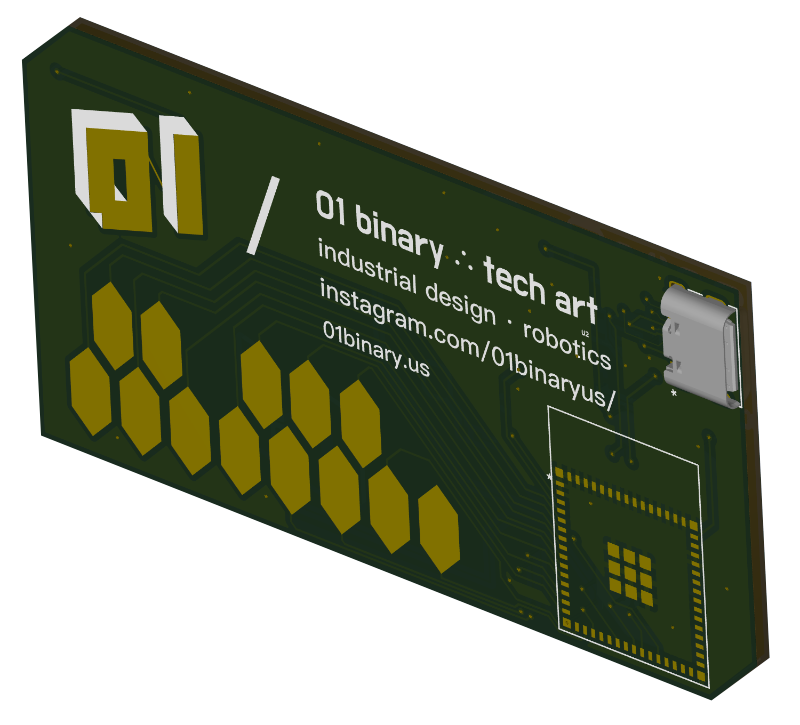

# Interactive Business Card

A two-sided PCB business card designed in `KiCad 9`, built around an `ESP32-S2-MINI-2` module, powered by `USB-C` or a `CR2032` coin cell.

+ Capacitive-Touch Piano Keys (`C4`–`C5`, one octave)
+ Piezo Speaker (Monophonic Tone Playback)
+ Capacitive Logo Touch Pad (Wake / Power Control)
+ USB-C or `CR2032` Power, Auto-Switched
+ Deep Sleep for Low Power Consumption

## Modules

The following module is placed onto the board:

|Module|Function|
|-|-|
|`ESP32-S2-MINI-2-N4`|MCU module with native USB, capacitive-touch inputs, and deep sleep|

## Power

Power comes from either a `USB-C` connector (through a `3.3V` LDO regulator) or a `CR2032` coin cell battery.

A `TPS2121` power multiplexer (`U_PWR`) automatically prioritizes `USB` power when plugged in, and switches back to coin cell power when unplugged, with no interruption to the `3.3V` rail.

| Stage | Component | Function |
|-|-|-|
| `USB` → `3.3V` | `AP2112K-3.3` (`U2`) | LDO regulator, converts `VBUS` (`5V`) down to `3.3V` |
| `USB` / Battery Switch | `TPS2121` (`U_PWR`) | Selects `USB 3.3V` or `CR2032 3V`, prioritizing `USB` |
| Coin Cell | Keystone `3034` (`BT1`) | Holder for `20mm CR2032` battery |

Decoupling/bulk capacitors on the `3.3V` rail:

|Capacitor|Value|Purpose|
|-|-|-|
|`C1`|`100µF`|Bulk capacitor, stabilizes rail against low-frequency dips (battery power draw)|
|`C2`|`10µF`|LDO output filter|
|`C3`|`0.1µF`|Local high-frequency bypass near the MCU|

### USB-C Configuration

The `USB-C` receptacle (`J1`) is configured for `UFP` (Upstream Facing Port) mode, meaning the card acts as a `USB` device, not a host.

+ `CC1` and `CC2` are each pulled to `GND` through `5.1kΩ` resistors (`R1`, `R2`), advertising the device role per the `USB Type-C` spec.
+ Only one of `CC1`/`CC2` is active depending on cable orientation, but both are populated so the connector works either way.
+ When plugged in, the host detects the pull-downs and supplies `5V` on `VBUS`.
+ No `USB-PD` negotiation is needed since the board only draws default `5V` at low current.

## Touch Interface

The front of the card has 13 capacitive touch pads forming one octave of piano-style keys (`C4`–`C5`), plus a two-piece logo pad that is electrically bridged into a single touch input.

+ Touching a piano key plays its corresponding tone through the piezo speaker.
+ Touching the logo pad wakes the device from deep sleep and acts as the soft power button.
+ After a period of inactivity, the firmware drops to a reduced CPU frequency and then enters deep sleep; touching the logo is the wake source.
+ All touch pads and I/O are additionally brought out as test points for flexibility in layout and debugging.

## Audio

When a key is touched, the firmware plays a monophonic tone through a piezo transducer (`LS1`), driven differentially from two `GPIO` pins through `100Ω` series resistors (`R3`, `R4`).

## Buttons

|Button|Function|
|-|-|
|`SW1`|`RESET` — pulls `EN` low to reset the MCU|
|`SW2`|`BOOT` — pulls `GPIO0` low to enter flashing mode|

## Pins

|Pin|Function|
|-|-|
|`GPIO19`|USB `D-` (`J1`)|
|`GPIO20`|USB `D+` (`J1`)|
|`GPIO0`|`BOOT` Button (`SW2`)|
|`EN`|`RESET` Button (`SW1`)|
|`3V3`|Power input from `U_PWR` (`TPS2121`) `OUT`|
|`GPIO26`|Piezo Driver `A` → `R3` → `LS1 +`|
|`GPIO17`|Piezo Driver `B` → `R4` → `LS1 -`|
|`GPIO1`|Touch Key `C` (`TP1`)|
|`GPIO2`|Touch Key `C#` (`TP2`)|
|`GPIO3`|Touch Key `D` (`TP3`)|
|`GPIO4`|Touch Key `D#` (`TP4`)|
|`GPIO5`|Touch Key `E` (`TP5`)|
|`GPIO6`|Touch Key `F` (`TP6`)|
|`GPIO7`|Touch Key `F#` (`TP7`)|
|`GPIO8`|Touch Key `G` (`TP8`)|
|`GPIO9`|Touch Key `G#` (`TP9`)|
|`GPIO10`|Touch Key `A` (`TP10`)|
|`GPIO11`|Touch Key `A#` (`TP11`)|
|`GPIO12`|Touch Key `B` (`TP12`)|
|`GPIO13`|Touch Key `C` (octave up) (`TP13`)|
|`GPIO14`|Touch Logo Pad, wake source (`TP14`, bridged)|

## Bill of Materials

|Component|Description|
|-|-|
|[ESP32-S2-MINI-2-N4](https://www.digikey.com/en/products/result?keywords=ESP32-S2-MINI-2-N4)|Main MCU with native USB and capacitive-touch capability|
|[AP2112K-3.3TRG1DICT-ND](https://www.digikey.com/en/products/result?keywords=AP2112K-3.3TRG1)|`3.3V` LDO regulator for USB power source|
|[TPS2121RUXR](https://www.digikey.com/en/products/result?keywords=TPS2121RUXR)|Power multiplexer, auto-switches between USB `3.3V` and `CR2032` battery|
|[Keystone 3034](https://www.digikey.com/en/products/result?keywords=3034)|Holder for `20mm CR2032` battery|
|[UJ20-C-H-G-MSMT-5-P16-TR](https://www.digikey.com/en/products/result?keywords=UJ20-C-H-G-MSMT-5-P16-TR)|USB-C receptacle for power and programming|
|[TLSMDT3C020GLFS](https://www.digikey.com/en/products/detail/c-k/TLSMDT3C020GLFS/14553425)|`SW1`/`SW2` Momentary pushbutton, RESET (`EN`) and BOOT (`GPIO0`)|
|[SMT-1141-T-5-R](https://www.digikey.com/en/products/detail/pui-audio-inc/SMT-1141-T-5-R/6192576)|Piezo transducer, audio output for tone playback|
|[RMCF0603FT5K10CTND](https://www.digikey.com/en/products/result?keywords=RMCF0603FT5K10)|`5.1kΩ` `0603` resistor, USB-C `CC` pull-downs (`R1`, `R2`)|
|[RMCF0603JT100RCTND](https://www.digikey.com/en/products/result?keywords=RMCF0603JT100R)|`100Ω` `0603` resistor, piezo driver series protection (`R3`, `R4`)|
|[CL32A107MPVNNNE](https://www.digikey.com/en/products/result?keywords=CL32A107MPVNNNE)|`100µF` capacitor, bulk power stabilization (`C1`)|
|[GRM21BR61C106KE15K](https://www.digikey.com/en/products/result?keywords=GRM21BR61C106KE15K)|`10µF` `0805` capacitor, LDO output filter (`C2`)|
|[CS0805KKX7R0BB104](https://www.digikey.com/en/products/result?keywords=CS0805KKX7R0BB104)|`0.1µF` `0603` capacitor, local bypass near MCU (`C3`)|

`TP1`–`TP13` are capacitive piano key electrodes (`C4`–`C5`); `TP14` is the two-piece logo pad bridged into a single wake-source input. Neither requires a physical component.
